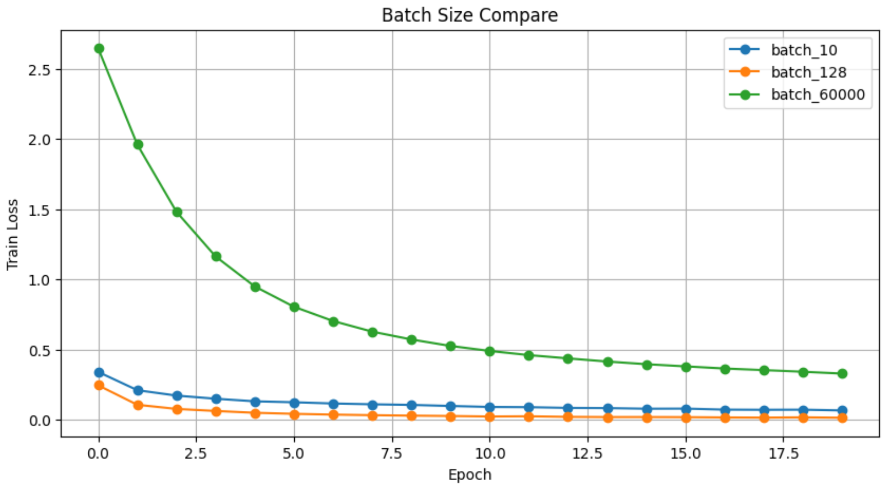
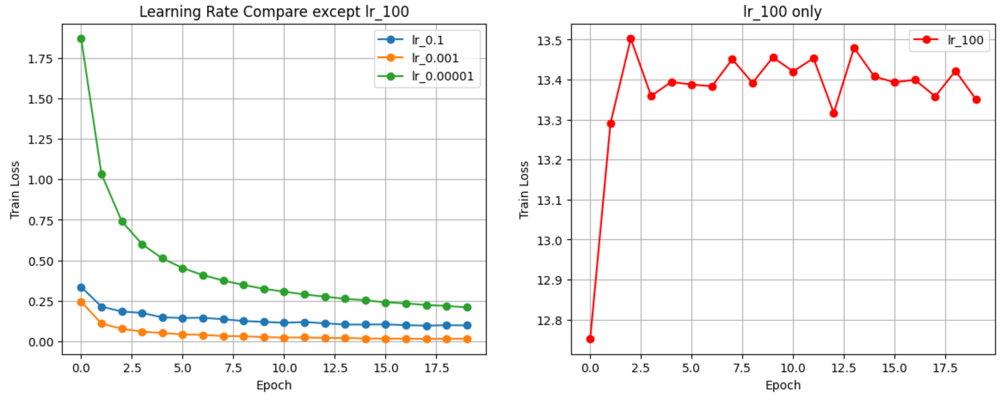
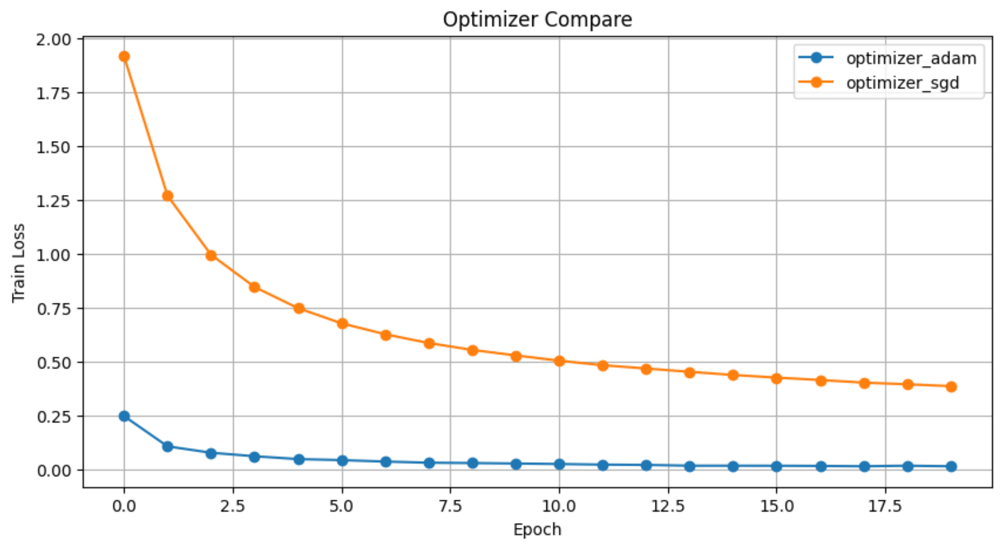
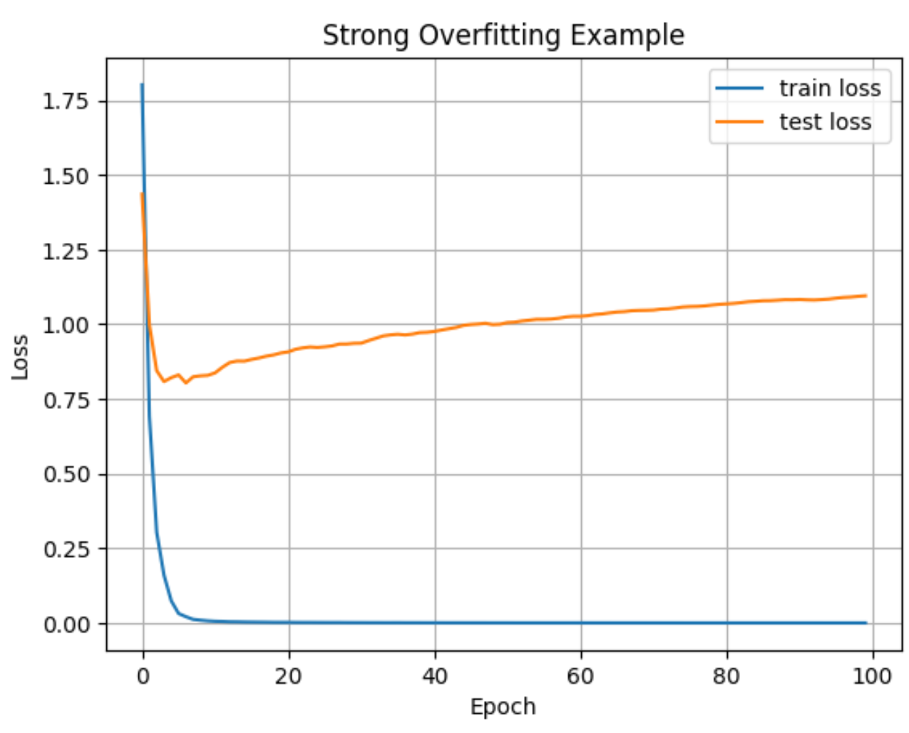
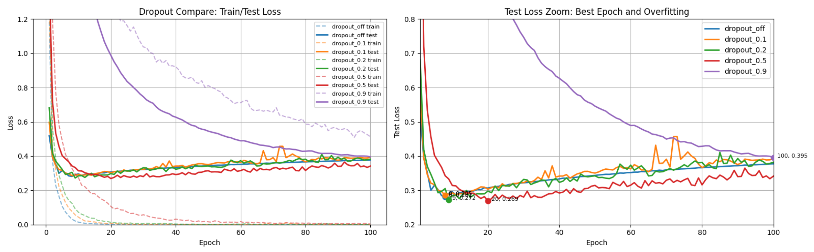

# MNIST 손글씨 인식 과제 보고서

## 0. 반·팀원

| 항목     | 내용            |
| ------ | ------------- |
| **조**  | 301 - 5조    |
| **팀원** | 고명석, 강지현, 김원우, 김은재 |

---

## 1. 실험 목적

MNIST 10-class 분류를 **NumPy만으로 구현한 신경망**으로 수행하고, 테스트 정확도와 학습 과정을 보고합니다.

---

## 2. 모델 구조

| 구분      | 내용                                                               |
| ------- | ---------------------------------------------------------------- |
| **입력**  | 784 (28×28 픽셀, 0~1 정규화)                                          |
| **은닉층** | Affine → BatchNorm → ReLU → Dropout 순으로 구성 |
| **출력**  | Affine(→10) + Softmax                                            |

**모델 구조 : 2층 은닉**

입력 784 → Affine(512) → BatchNorm → ReLU → Dropout → Affine(256) → BatchNorm → ReLU → Dropout → Affine(10) → Softmax

---

## 3. 학습 설정

| 항목                 | 값           |
| ------------------ | ----------- |
| 옵티마이저              | Adam        |
| 학습률 (lr)           | 0.001       |
| epochs             | 20          |
| batch_size         | 128         |
| Dropout 비율         | 0.5         |
| BatchNorm momentum | 0.9         |
| 가중치 초기화            | He (bias 0) |

---

## 4. 실험 환경

- Python 3.11, NumPy, Matplotlib
- 학습 소요 시간: CPU 기준 약 200초

---

## 5. 결과

| 항목           | 값              |
| ------------ | -------------- |
| **테스트 정확도**  | 98.45%    |
| **총 파라미터 수** | 537,354 |

## 손실 커브

### Batch Size Compare

| Model | Train Loss | Test Loss | Accuracy | Total Params | Time |
|---|---:|---:|---:|---:|---:|
| batch_10 | 0.0653 | 0.0490 | 98.49% | 537,354 | 1790.33s |
| batch_128 | 0.0135 | 0.0607 | 98.38% | 537,354 | 209.88s |
| batch_60000 | 0.3279 | 0.2548 | 92.50% | 537,354 | 106.06s |

---

### Learning Rate Compare

| Model | Train Loss | Test Loss | Accuracy | Total Params | Time |
|---|---:|---:|---:|---:|---:|
| lr_100 | 13.3510 | 13.3918 | 9.58% | 537,354 | 221.26s |
| lr_0.1 | 0.0975 | 0.0961 | 97.89% | 537,354 | 213.79s |
| lr_0.001 | 0.0149 | 0.0537 | 98.44% | 537,354 | 203.42s |
| lr_0.00001 | 0.2085 | 0.1600 | 95.31% | 537,354 | 205.01s |

---

## Optimizer Compare
| Model | Train Loss | Test Loss | Accuracy | Total Params | Time |
|---|---:|---:|---:|---:|---:|
| optimizer_adam | 0.0142 | 0.0598 | 98.45% | 537,354 | 216.86s |
| optimizer_sgd | 0.3858 | 0.2930 | 92.11% | 537,354 | 163.61s |

\

---

## Dropout 실험 결과 비교

| Model | Best Epoch | Best Test Loss | Final Test Loss | Final Train Loss | Train Accuracy | Test Accuracy |
|---|---:|---:|---:|---:|---:|---:|
| dropout_off | 8 | 0.2814 | 0.3774 | 0.0001 | 100.00% | 92.40% |
| dropout_0.1 | 8 | 0.2854 | 0.3922 | 0.0001 | 100.00% | 92.45% |
| dropout_0.2 | 9 | 0.2720 | 0.3822 | 0.0003 | 100.00% | 92.68% |
| dropout_0.5 | 20 | 0.2689 | 0.3414 | 0.0032 | 100.00% | 92.63% |
| dropout_0.9 | 100 | 0.3950 | 0.3950 | 0.5129 | 94.00% | 88.48% |

---
## 6. 회고

이번 실험을 통해 하이퍼파라미터가 학습 과정과 일반화 성능에 매우 큰 영향을 준다는 점을 직접 확인할 수 있었다.

Learning Rate 실험에서는 값이 너무 작은 경우 loss가 매우 천천히 감소하여 제한된 epoch 내에 충분히 수렴하지 못했고, 반대로 너무 큰 경우에는 loss가 크게 진동하며 발산하는 현상이 발생하였다. 이를 통해 적절한 learning rate 설정이 안정적인 학습과 수렴에 핵심적인 요소라는 점을 이해할 수 있었다.

Batch Size 실험에서는 단순히 업데이트 횟수가 많다고 항상 더 좋은 성능으로 이어지는 것은 아니라는 점을 확인하였다. 작은 batch size는 noisy gradient를 발생시켜 학습 방향을 흔들리게 만들지만, 이러한 특성이 오히려 regularization 효과처럼 작용하여 일반화 성능 향상에 도움이 될 수 있다는 점이 인상적이었다.

또한 train data를 줄여 과적합을 유도한 실험에서는 train loss는 빠르게 감소했지만, test loss는 일정 시점 이후 다시 증가하는 현상을 확인할 수 있었다. 이를 통해 모델이 단순히 데이터를 암기하는 것과 새로운 데이터에 대해 일반화하는 것은 서로 다른 문제라는 점을 체감할 수 있었다.

Dropout 실험에서는 dropout=0.5에서 가장 높은 성능을 보였다. 이는 특정 뉴런에 대한 과도한 의존을 줄여 과적합을 완화하고, 일반화 성능을 향상시킨 결과라고 생각한다. 반면 dropout 값이 지나치게 큰 경우에는 학습 자체가 어려워질 수 있다는 점도 함께 확인할 수 있었다.

전체적으로 이번 실험을 통해 모델 구조뿐만 아니라 하이퍼파라미터 조정 과정 역시 모델 성능에 매우 큰 영향을 준다는 점을 이해하게 되었다. 또한 train loss와 test loss를 함께 관찰하며 모델의 수렴 여부와 과적합 여부를 분석하는 과정의 중요성을 배울 수 있었다.
